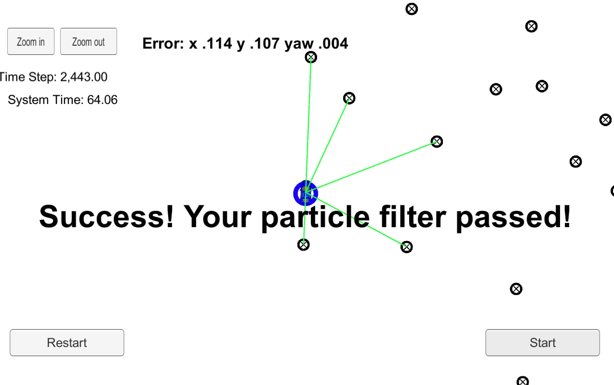

# Kidnapped Vehicle - Particle Filter Project

Using particle filter we localize the vehicle with respect to landmark measurements and measurements recorded through various sensors mounted on the car.

## Content

Some of the important files and folders are listed below:

**/src**
- The src folder consists of the following important .cpp files:
    - particle_filter.cpp
        - implementation of Particle Filter which localizes the car on the map with respect to the sensor measurements and landmark measurements
    - main.cpp
        - main procedure implementation

**/Debug**
- This folder consists of executable file **particle_filter.sh** which runs the main procedure of the project

**/data**
- Consists of the file **map_data.txt** which stores the landmark measurements used for the project

**CMakeLists.txt**
- Cmake file to build the project

**PARTICLE_FILTER.xcodeproj**
- Xcode IDE project file used to build the project files

**build.sh**
- To build the project in case we are not using an IDE

**run.sh**
- To run the project in case we are not using an IDE

**clean.sh**
- To clean the project

## Usage

1. Run the **particle_filter.sh** executable file to run the program.
2. Run Udacity's Simulator and select 'Project 3: Kidnapped Vehicle'.
3. Click on 'Start'.
4. The error in X, Y and Yaw will be displayed on the screen.

**Note:** Run the executable file through terminal after navigating to the Debug folder to ensure the program locates the map_data.txt file correctly as we have specified a relative path in the program.

## Observations

- The number of particles is a critical parameter of a Particle Filter which needs to be tuned.
- Let us record error for various number of particles and study the results

| Number of Particles | X error | Y error | Yaww error | Execution Time (seconds) |
|---------------------|---------|---------|------------|--------------------------|
|10                   |0.161    |0.151    |0.005       |63.72                     |
|20                   |0.131    |0.126    |0.004       |62.92                     |
|50                   |0.119    |0.113    |0.004       |65.35                     |
|100                  |0.114    |0.107    |0.004       |64.06                     |
|250                  |0.112    |0.104    |0.004       |72.42                     |
|500                  |0.111    |0.100    |0.003       |72.72                     |

## Conclusion
- From the above observations it is clear that as we increase the number of pixels the execution time increases (though there is an exception for 100 particles where time has decreased marginally).
- Also increase in number of particles also provides a better accuracy.
- For an optimum result a trade-off between execution time and accuracy should be balanced as per the requirement.
- For our project we have selected 100 particles to execute our program accurately.
